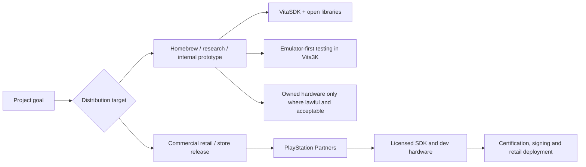
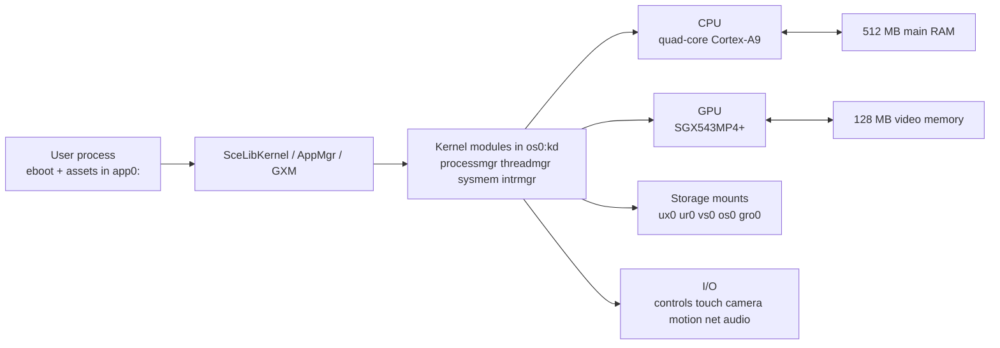

# Designing a Comprehensive PS Vita Development Document

## Executive summary

A rigorous public-facing PS Vita development document should be split into two clearly separated tracks: an **open/homebrew track** built around urlVitaSDKturn18search1 and other open tools, and a **licensed commercial track** available only through urlPlayStation Partnersturn16search0. That split is not cosmetic. The public/open stack is explicitly positioned for homebrew on hacked consoles, while the commercial path depends on platform-holder approval, licensed SDKs, dev hardware, documentation, testing systems and support that are not publicly available. Public Sony materials do cover consumer-visible hardware, storage, power and system-software basics, but most low-level development internals available without NDA come from open SDK documentation and reverse-engineered developer wikis. citeturn16search0turn18search1turn18search5turn42view0turn42view2

At the hardware level, the publicly supportable baseline is strong enough for practical engineering: a quad-core ARM Cortex-A9 MPCore application processor, an SGX543MP4+ tile-based deferred GPU, 512 MB main RAM plus 128 MB video memory in the SoC package, 5-inch 960×544 display, dual cameras, front and rear touch, motion sensors, Wi‑Fi, Bluetooth and model-dependent mobile networking or internal user storage. Public low-level references also expose useful architectural anchors such as the ARM private peripheral region, PL310 L2 cache mapping, TTBR split around 0x40000000, GPU system-level cache and the tile/parameter-buffer pipeline. citeturn32view1turn32view0turn33view2turn31search7turn12view0turn12view1turn12view2turn26search0turn26search1

For an open, legally cautious workflow, the best-supported stack is: **VitaSDK + CMake + Ninja + a thin graphics library such as libvita2d or SDL2, optionally vitaGL for portability, with Vita3K as the primary fast-iteration target**. For a commercial retail release, the recommendation is much simpler: **use the licensed partner programme or do not plan for retail/store distribution at all**. Public/open tools can produce SELF/VPK packages for homebrew, but they are not a substitute for Sony-signed retail packages, certification or partner tooling. citeturn18search0turn19search7turn19search13turn46search0turn46search6turn46search18turn16search0

The most important engineering advice follows directly from the architecture. The CPU rewards cache-friendly job systems and careful threading. The GPU rewards batching, minimising render-target switches, controlling overdraw and avoiding bandwidth-heavy full-screen work because the SGX543MP4+ is explicitly tile-based and performs hidden-surface removal before fragment shading. Where public data is incomplete — notably exact public memory-bandwidth figures, Sony-certified thermal budgets, and a neat official public texture-format matrix — the document should say so plainly rather than hard-coding folklore as fact. citeturn32view0turn32view1turn8view0turn8view1turn12view0turn12view1

## Research footing and target profiles

The most defensible source hierarchy for a PS Vita document is: **official Sony consumer documentation first**, **official open-tool documentation second**, and **clean-room / reverse-engineered technical references third**. In practice, that means public Sony manuals and support pages for model, battery, thermal, Wi‑Fi, Bluetooth and system software; VitaSDK documentation and repositories for build, packaging and public APIs; and public PS Vita developer wikis for memory regions, GPU block diagrams, package composition and filesystem mounts that Sony does not publish in consumer manuals. citeturn3view0turn4search1turn18search1turn18search5turn42view0turn32view0turn32view1

The target-profile split should be explicit in the document:

- **Commercial / retail distribution**: use the partner path, licensed SDKs, partner tooling, dev hardware and certification. Public details are intentionally limited. citeturn16search0turn15search0
- **Open homebrew**: use VitaSDK and open libraries. This path is suitable for public experimentation and emulator-first development, but it is not a Sony-compliant substitute for shipping through official retail channels. VitaSDK’s own project description explicitly frames the toolchain around homebrew on hacked consoles. citeturn18search1turn19search0



As a matter of legal hygiene, the document should also state that it **excludes exploit steps, key extraction, or procedures whose main purpose is to bypass Sony security or platform terms**. That keeps the engineering document focused on lawful toolchains and architecture rather than circumvention.

## Platform hardware

Public Sony documentation gives the visible consumer profile, while public technical references fill in the processor and memory internals. The result is enough for a serious hardware chapter, provided you clearly label which facts come from official manuals and which come from public reverse engineering. The handheld family has two main developer-relevant retail variants: **PCH-1000**, which uses the OLED model with proprietary memory cards and the multi-use port, and **PCH-2000**, which uses the LCD “Slim” model, moves to USB, and exposes approximately 1 GB of internal user-accessible memory. Both expose front/rear cameras, front touchscreen, rear touch pad, dual analogue sticks, stereo speakers and microphone. citeturn12view0turn12view1turn12view2turn6view0turn6view1

Public low-level references identify the application processor as a **quad-core ARM Cortex-A9 MPCore** implementing ARMv7, with community-documented operating clocks from **111 MHz to 500 MHz**, **32 KB instruction cache and 32 KB data cache per core**, an ARM private peripheral region at **0x1A000000**, and the **PL310 L2 cache controller** mapped at **0x1A002000**. Public package analysis additionally identifies a package containing the CPU die, **4 Gb Mobile DDR2** for system memory and **1 Gb Samsung GDDR5 / wide-I/O-class video memory**, which matches the widely cited **512 MB main RAM + 128 MB VRAM** design. Reverse-engineered public memory notes further indicate a TTBR split at **0x40000000** and user-mode main-memory mapping beginning at **0x40000000**. These details are development-useful, but they are not from Sony’s consumer manuals and should be marked accordingly in the final document. citeturn32view1turn33view2turn33view3turn31search7turn26search0turn26search1



### Hardware facts that are public enough to document

| Area | Publicly supportable finding | Confidence / source type |
|---|---|---|
| CPU | Quad-core ARM Cortex-A9 MPCore, ARMv7 | Public reverse-engineered technical reference |
| CPU clock | Community-documented 111–500 MHz range | Public reverse-engineered technical reference |
| CPU cache | 32 KB I-cache + 32 KB D-cache per core; PL310 L2 controller present | Public reverse-engineered technical reference |
| Memory | 512 MB main RAM + 128 MB video memory in the SoC package | Public package analysis / reverse engineering |
| MMU / map anchors | TTBR split at 0x40000000; user-mode main-memory mapping at 0x40000000 | Public reverse-engineered technical reference |
| Display | 5-inch, 960×544, OLED on PCH-1000; LCD on PCH-2000 | Official Sony manuals |
| Cameras | Front and rear cameras, max 640×480 | Official Sony manuals |
| Input | Front touchscreen, rear touch pad, dual sticks, headset jack, mic | Official Sony manuals |
| Networking | Wi‑Fi 802.11b/g/n, Bluetooth 2.1+EDR; 3G/HSDPA variant on some PCH-1000 models | Official Sony manuals |
| User storage | Proprietary memory card support; PCH-2000 adds approx. 1 GB internal user memory | Official Sony manuals |
| Power | Built-in Li-ion battery, rated 2210 mAh; approx. 6 W max power consumption while charging | Official Sony manuals |
| Thermal / environment | Operating 5–35 °C; charging recommended at 10–30 °C | Official Sony manuals |

The table above is synthesised from public Sony manuals and public technical references rather than a single Sony engineering document. citeturn12view0turn12view1turn12view2turn8view0turn8view1turn32view1turn33view2turn26search0turn26search1

The power/thermal chapter should avoid invented TDP numbers. Public Sony documents give **operating temperature**, **charging temperature**, **battery ratings**, **charging time**, **estimated battery life**, and warnings that heat build-up inside cases or covers can damage the unit. They do **not** publish a public developer-facing thermal budget, cooling design limit or sustained package power target. So the correct wording is: **publicly documented environmental envelope exists; public developer thermal budget does not**. citeturn8view0turn8view1turn13view0

## GPU and rendering model

The public low-level identity of the PS Vita GPU is unusually clear: the SoC contains a **PowerVR SGX543MP4+**, described in public technical references as a **multi-core, tile-based deferred rendering GPU with unified shader architecture**. The public block description is rich enough to support a genuinely useful architecture section: master blocks distribute work across cores; a parameter buffer stores scene/tile command streams; a tiling accelerator bins geometry; hidden-surface removal happens in the ISP before fragment shading; the GPU has a **256 KB system-level cache** and dedicated texture/data caches. This is exactly the kind of information that should drive rendering advice in the document. citeturn32view0

The trickiest part of the GPU chapter is separating **hardware class** from **Vita API surface**. Public SGX543 references describe a **DirectX 9.0 / OpenGL 2.1-class** programmable design, and VitaSDK documentation exposes the **GPU Graphics Library**, **runtime shader compiler**, and **GXT texture helpers**. For Vita development, however, the public programming surface is not desktop DirectX or desktop OpenGL. In practice, the public/open path is **GXM-style low-level programming and wrappers built on top of it**, such as libvita2d and community OpenGL-like layers. That distinction needs to be explicit to avoid misleading readers into expecting stock OpenGL drivers on the device. citeturn32view0turn18search13

### GPU facts and safe inferences

| Topic | Publicly supportable statement | How to write it in the document |
|---|---|---|
| GPU model | SGX543MP4+ | State directly |
| Architecture | Tile-based deferred renderer with unified shaders | State directly |
| Shader pipeline | Public Vita docs expose a runtime shader compiler for Cg shaders; hardware uses USSE shader engines | State directly, but call the public shader toolchain “Cg-based” |
| Cacheing | 256 KB SLC plus per-core texture/data caches | State directly |
| API surface | Public/open development uses GXM-family interfaces and wrapper libraries, not consumer OpenGL/D3D drivers | State directly |
| Fillrate | Public SGX543 reference figure is **1000 MPixel/s and 35 MTriangles/s at 200 MHz** | State as a **reference/theoretical SGX figure** |
| Clock scaling | If a title runs the GPU below or above 200 MHz, theoretical fillrate scales roughly linearly | Mark clearly as an estimate |
| Texture formats | Public open headers expose many formats, but there is no concise Sony public matrix suitable for certification-level claims | State as incomplete / verify against headers |
| Memory bandwidth | No Sony public engineering figure was found in public sources; do not present a single “official” GB/s number | State as undocumented publicly |

This table is supported by the public SGX543/Vita graphics reference and VitaSDK’s graphics-topic documentation. citeturn32view0turn18search13turn36search0

The most valuable rendering guidance for PS Vita comes straight from the tile-based design:

- **Reduce overdraw**, especially translucent layers and full-screen compositing passes.
- **Batch by render target and state** so you do not force unnecessary tile flushes or resolves.
- **Submit opaque geometry early** so hidden-surface removal rejects occluded fragments before shading.
- **Prefer atlases and stable texture bindings** over frequent small texture changes.
- **Be careful with render-to-texture chains**, post-processing stacks and readbacks, because they can erode the bandwidth advantages of TBDR.
- **Keep dynamic geometry streaming predictable** and reuse buffers rather than reallocating per frame. citeturn32view0

A sensible wording for performance figures is: *“Public SGX543 reference material quotes 35 MTriangles/s and 1000 MPixel/s at 200 MHz. Actual PS Vita title performance depends on the clock configuration chosen by the title, the memory system, render-target traffic, overdraw and driver overhead, so those figures are theoretical ceilings rather than guaranteed game throughput.”* citeturn32view0turn36search0turn36search4

## System software, filesystem, and I/O

The public user guide currently covers system software **3.73 or later**, and the public support page lists **3.74** as the current PS Vita system software update at the time of writing. For a public development document, that means you should phrase system-software support as **“retail 3.7x family”** unless you are writing specifically for a known homebrew runtime. For the commercial/licensed path, do not guess the certification matrix; the relevant SDK/firmware combinations are controlled through the licensed partner programme and are not public. citeturn3view0turn6view0turn6view1turn4search1

Public filesystem and module listings show a modular OS layout: **kernel modules** such as `processmgr.skprx`, `threadmgr.skprx`, `sysmem.skprx`, `intrmgr.skprx`, `iofilemgr.skprx` and `syscon.skprx` live under `os0:kd`, while important user-side modules such as `libkernel.suprx`, `libgpu_es4.suprx` and `libgxm_es4.suprx` appear under `os0:us`. Public VitaSDK docs also expose separate **kernel** and **user** libraries, plus an **Interrupt Manager**, **Exception handling**, **Fiber**, **Power**, **Network**, **Audio**, **Control**, **Touch**, **Camera** and **Location** surface. That is enough to describe the public process model as: a sandboxed user process launched via AppMgr/ProcessMgr, making syscalls through libkernel, with additional threads/fibres and module-based services rather than direct bare-metal access. citeturn42view2turn39search2turn18search5turn19search16

On interrupts, the most accurate public wording is that the platform implements the **ARM Generic Interrupt Controller architecture** as part of the Cortex-A9 MPCore, and public VitaSDK docs expose a **kernel-side interrupt manager**. In practice, user applications should not be documented as registering raw hardware interrupts directly; instead, they consume higher-level device and library APIs while kernel modules and drivers manage the actual interrupt plumbing. citeturn32view1turn39search2turn39search11

### Standard public path and mount conventions

| Mount / path | Meaning | Safe way to document it |
|---|---|---|
| `app0:/eboot.bin` | Current application executable | Read-only packaged app content |
| `app0:/sce_sys/param.sfo` | Application metadata | Read-only packaged metadata |
| `app0:/sce_sys/livearea/...` | LiveArea assets | Packaged UI assets |
| `savedata0:/sce_sys/...` | Save-data metadata and per-title secure data | Per-title save area |
| `os0:` | Core OS / kernel modules / low-level user libraries | Treat as read-only system partition |
| `vs0:` | Shell and system applications | Treat as read-only system partition |
| `ur0:` | Internal user-data partition on NAND, similar in structure to memory-card layout | Internal persistent storage |
| `ux0:` | Primary memory card storage | Primary removable/user storage |
| `gro0:` | Game card | Read-only game media |
| `grw0:` | Writable game-card partition if supported | Optional writable media |
| `ud0:` | Update staging area | System-managed only |
| `vd0:` | System registry area | System-managed only |
| `uma0:` | USB mass storage mapping in some environments | Environment-dependent; do not assume in retail apps |

The table above is assembled from public filesystem listings. Note that these are a mix of official partition names surfaced through public tools and community documentation; access permissions differ sharply between licensed apps, homebrew and system software. citeturn42view0turn42view2

For sample file paths in an open-source document, use examples that mirror the known mount structure and keep read-only versus writable areas separate:

```text
app0:/eboot.bin
app0:/sce_sys/param.sfo
app0:/sce_sys/livearea/contents/template.xml
savedata0:/sce_sys/param.sfo
ux0:/                       # memory card root
ur0:/                       # internal user-data root
```

Those packaged paths follow the public filesystem listing and the VPK packaging layout expected by VitaSDK’s CMake tooling. citeturn42view0turn42view2turn18search0

The I/O chapter can be quite concrete from official Sony sources. Hardware controls include the standard PlayStation face/directional buttons, Start/Select, dual analogue sticks, front touchscreen, rear touch pad, stereo speakers, microphone, headset jack, front camera and rear camera; motion support includes motion sensors and an electronic compass. Public API documentation adds that the control library covers keypad/controller state, the touch library exposes touch-panel geometry, the location library covers GPS on supported models, the Bluetooth library is kernel-side, and the USB driver / USB serial libraries are exposed in VitaSDK documentation. citeturn6view0turn6view1turn6view2turn45search1turn45search2turn45search11turn45search13turn45search15

Networking is also straightforward publicly. Official Sony specs list **IEEE 802.11b/g/n** Wi‑Fi, note that **802.11n is only 1×1**, list **Bluetooth 2.1+EDR**, and — on 3G/Wi‑Fi models — add mobile data support via **HSDPA/HSUPA** and **GSM/GPRS/EDGE**. The official user guide lists supported Bluetooth profiles including **A2DP, AVRCP, HSP and HID**, and notes that up to **seven Bluetooth devices** can be connected at the same time. Public VitaSDK network docs cover sockets, HTTP, SSL, Bluetooth and PSP/adhoc families. citeturn13view0turn12view1turn12view2turn6view4turn45search17

For audio, the public Sony hardware documents describe built-in stereo speakers, a built-in microphone and headset support, while VitaSDK documents the user audio API around `SceAudioOut`. The key public engineering detail is that the **main audio output port expects 48 kHz**, with **S16 mono or stereo** output modes documented in the API. That is enough to justify a project-wide recommendation to mix internally at 48 kHz stereo and only resample once at the edge if you import assets at other sample rates. citeturn12view0turn12view1turn43search1

## Toolchains, packaging, debugging, and profiling

The public toolchain story is mature for homebrew and intentionally incomplete for retail commercial development. urlVitaSDKturn18search1 is the open-source toolchain; urlPlayStation Partnersturn16search0 is the licensed commercial route; urlCMakehttps://cmake.org and urlNinjahttps://ninja-build.org are the most sensible host-side build front-ends; and urlVita3Kturn46search15 is the emulator you should use for rapid iteration in a lawful, publicly accessible workflow. VitaSDK’s own repositories show host tools, a GCC/newlib-based cross toolchain, sample CMake projects, and a `vita.cmake` layer that creates SELF and VPK outputs. citeturn18search15turn19search7turn19search13turn18search0turn46search18

### SDK, toolchain and deployment comparison

| Stack | Typical use | Licence / access posture | Retail-store suitability | Licensing / terms risk |
|---|---|---|---|---|
| urlPlayStation Partnersturn16search0 official path | Licensed commercial development, dev hardware, certification | Proprietary, partner-only, agreement-based | **Yes** | Low legal risk if you are an approved partner; public details unavailable |
| urlVitaSDKturn18search1 + urlvita-toolchainhttps://github.com/vitasdk/vita-toolchain | Open homebrew and research development | Open-source; public | **No** for official retail/store release | Low OSS-licence risk, but not a Sony-compliant retail path |
| urlVita3Kturn46search15 / urlVita3K repohttps://github.com/vita3k/vita3k | Fast emulator-first testing and CI smoke checks | GPL-2.0 for emulator repo | N/A | Low if used as a separate tool; watch GPL obligations if embedding code |
| SoftFP community variants of VitaSDK | Niche Android-to-Vita loader/port projects | Open-source, community forks | **No** | Medium: technically useful in a niche, but not the cleanest baseline for new work |

The table summarises publicly visible licence/access posture from project pages and partner materials. citeturn16search0turn18search1turn19search1turn19search7turn46search18turn19search11turn19search17

For greenfield development, the open build workflow should be documented in a way that is boring and reproducible. VitaSDK sample projects show a standard pattern: define `VITASDK`, point CMake at the Vita toolchain file, include `vita.cmake`, build an ELF/SELF, then package a VPK with `sce_sys` assets such as `param.sfo`, `icon0.png` and LiveArea images. That is the best public baseline because it is open, documented and repeatable. citeturn18search0turn18search6turn19search13turn42view0

A minimal host-side build sequence looks like this:

```bash
export VITASDK=/opt/vitasdk
export PATH="$VITASDK/bin:$PATH"

cmake -S . -B build \
  -DCMAKE_TOOLCHAIN_FILE="$VITASDK/share/vita.toolchain.cmake" \
  -G Ninja

cmake --build build
```

That matches the public VitaSDK sample style and keeps the host/frontend choices conventional. citeturn18search6turn18search7turn19search13

A minimal `CMakeLists.txt` structure for an application package can be documented like this:

```cmake
cmake_minimum_required(VERSION 3.16)
project(sample_vita C CXX)

include("${VITASDK}/share/vita.cmake" REQUIRED)

set(VITA_APP_NAME "Sample Vita App")
set(VITA_TITLEID  "SAMP00001")
set(VITA_VERSION  "01.00")

add_executable(sample
    source/main.c
)

target_link_libraries(sample
    SceDisplay_stub
    SceCtrl_stub
    SceGxm_stub
)

vita_create_self(eboot.bin sample)
vita_create_vpk(sample.vpk ${VITA_TITLEID} eboot.bin
    VERSION ${VITA_VERSION}
    NAME    ${VITA_APP_NAME}
    FILE    ${CMAKE_SOURCE_DIR}/sce_sys/icon0.png sce_sys/icon0.png
    FILE    ${CMAKE_SOURCE_DIR}/sce_sys/livearea/contents/template.xml sce_sys/livearea/contents/template.xml
)
```

The important point is not the exact stub list; it is the pattern of **ELF → SELF → VPK**, with packaged `sce_sys` metadata and LiveArea assets. citeturn18search0turn18search2turn42view0

On packaging and signing, the public/open answer is simple: **VitaSDK can package homebrew, but it cannot turn an open project into an officially retail-signed PS Vita title**. If the intended use is commercial retail distribution, your document should explicitly route the reader to urlPlayStation Partnersturn16search0 for licensed SDK access, platform requirements, signing and certification. If the intended use is open homebrew, then `vita_create_self` and `vita_create_vpk` are the right public packaging primitives to document. citeturn18search0turn16search0turn18search1

For debugging and profiling, the public situation is mixed. VitaSDK’s docs show that the platform exposes **GPU and CPU Capture**, **GPU and CPU Live Debugging**, **Performance**, **Performance analyse manager**, and user/kernel debug utilities. However, public documentation for a clean, partner-grade on-device workflow is thin compared with the licensed SDK world. In a lawful public workflow, the pragmatic recommendation is: **use emulator-first debugging in Vita3K, add aggressive frame-time and subsystem instrumentation inside your app, and treat low-level capture interfaces as advanced/niche rather than the cornerstone of your workflow**. citeturn36search2turn39search2turn46search18

A sensible public deployment ladder is therefore:

1. Build locally with VitaSDK.
2. Smoke-test in Vita3K on every change.
3. Use logging, timing markers, feature toggles and render-debug overlays for most day-to-day debugging.
4. Only if you are on the licensed commercial path should you plan around Sony’s partner-only deployment/profiling stack. citeturn18search1turn46search18turn16search0

## Open-source libraries, licensing risk, and recommendations

For a clean, open-source PS Vita document, the most useful “engine” chapter is really a **libraries and abstraction-layers chapter**. There is no mature public open-source equivalent of a full current-console commercial engine stack for Vita. The practical options are thin rendering/audio/input libraries and a deliberate custom engine layer over them. citeturn46search0turn46search6turn47search3turn47search13

### Library and engine comparison

| Library / tool | Best fit | Integration note | Licence posture | Licensing risk |
|---|---|---|---|---|
| urllibvita2dhttps://github.com/xerpi/libvita2d | Native 2D homebrew, HUDs, menus, simple sprite games | Thin GPU-backed 2D layer; best when you want Vita-native behaviour and low abstraction overhead | MIT | Low |
| urlSDL2https://libsdl.org | Portability-first C/C++ apps, tools, 2D games, input/audio abstraction | Great foundation layer; pair with a Vita-native renderer or GL-like wrapper as needed | zlib | Low |
| urlraylibhttps://www.raylib.com | Education, prototypes, small games | Publicly permissive, but Vita is not a first-class officially supported target; expect port-maintenance work | zlib/libpng | Low licence risk, medium maintenance risk |
| urlVita3Kturn46search15 | Testing, CI smoke tests, debugging support | Use as an external emulator, not an in-game dependency | GPL-2.0 | Low as a separate tool; higher if you plan to embed emulator code |
| urlDear ImGui Vita porthttps://github.com/Rinnegatamante/imgui-vita | Debug UIs, dev menus, tooling overlays | Excellent for profiling overlays and in-dev instrumentation | MIT | Low |
| `vitaGL` community layer | OpenGL-like portability for some 3D ports | Useful for ports; verify current repository health and exact licence before freezing policy | Community/open-source layer, re-verify | Low-to-medium depending maintenance and provenance |

The permissive-licence rows above are grounded in public project pages. The `vitaGL` row is included because it is widely used in public community ports, but its exact current licence/maintenance posture should be re-verified at the repository revision you adopt. citeturn46search0turn46search2turn46search6turn46search18turn47search3turn47search13turn47search0

The recommendations that fall out of this are straightforward.

For **greenfield 2D homebrew**, use **VitaSDK + libvita2d** unless portability is your top priority. That gives you a small stack, close control and minimal abstraction overhead. For **portable C/C++ titles**, use **SDL2** for windowless platform abstraction, input and audio, and keep your renderer isolated so you can swap between a Vita-native path and a higher-level compatibility path. For **3D work that must survive multiple platforms**, prefer a small custom renderer or a carefully profiled portability layer over chasing a “full engine” that the public Vita ecosystem does not really offer. citeturn46search0turn46search6turn46search14turn47search13

For CPU optimisation on Vita, the document should emphasise **data-oriented design, cache locality, predictable worker queues, coarse-grained tasks, and avoiding unnecessary copies**. On a quad-core Cortex-A9 with separate L1 caches per core and a shared L2 subsystem, you will normally get more from reducing memory traffic and synchronisation than from exotic micro-optimisations. Keep hot loops small, favour structure layouts that walk memory linearly, and isolate decompression, streaming, culling and animation jobs so they scale cleanly across cores without constant contention. These are architectural recommendations inferred from the public core/cache layout and the realities of handheld power budgets. citeturn32view1turn8view0turn8view1

For GPU optimisation, the public document should be stricter: **avoid using the PS Vita like an immediate-mode desktop GPU**. Design materials and render passes around the SGX543MP4+ tile-based deferred model. That means fewer render-target flips, less bandwidth-heavy post-processing, less alpha overdraw, tighter sprite batching, and careful thought about when to render transparent effects relative to the opaque scene. If your engine abstraction encourages “just add another full-screen pass”, it is probably fighting the hardware. citeturn32view0

The legal/licensing chapter should be candid. Public Sony documents state that the system software is licensed, that analysis/modification of the system is not authorised in that documentation, and that using unauthorised software to alter system software can void warranty/service entitlement. Meanwhile, VitaSDK openly identifies itself as an open-source homebrew toolchain for hacked consoles, and the partner programme is the public gateway for official commercial tools. So the cleanest lawful guidance is:

- **If you need retail/store release, become a licensed partner.**
- **If you need open/public experimentation, use VitaSDK and keep expectations to homebrew/emulator workflows.**
- **Do not conflate public homebrew packaging with official retail signing.**
- **Do not base a clean commercial plan on community Android-loader wrappers or asset-requiring ports unless you fully control the IP and licensing chain.** citeturn13view0turn18search1turn16search0turn19search11turn19search17

### Recommended default structure for the final development document

If you are drafting the actual PS Vita development document, the best high-level structure is:

1. **Audience and legal scope** — homebrew versus licensed commercial.
2. **Hardware architecture** — CPU, GPU, RAM/VRAM, storage, clocks, power and thermal envelope.
3. **Runtime model** — processes, modules, threads, fibres, interrupts, services.
4. **Filesystem and I/O** — mount points, packaged assets, save data, controls, touch, camera, sensors, networking, USB, audio.
5. **Rendering guidance** — GXM mental model, batching, formats, buffers, overdraw discipline.
6. **Build and packaging** — VitaSDK/CMake workflow, SELF/VPK, metadata and packaged assets.
7. **Debugging and profiling** — emulator-first loops, instrumentation, runtime feature flags.
8. **Risk and compliance appendix** — open-source licences, partner-only boundaries, unsupported/publicly undocumented areas. citeturn18search0turn18search1turn42view0turn32view0turn39search2

### Open questions and limitations

Some items requested in your brief are **not fully supportable from public, English-language, primary or near-primary sources** and should be flagged exactly that way in the final document:

- a single **official public memory-bandwidth figure** in GB/s;
- a published **Sony thermal budget / TDP / throttling policy** suitable for engineering guarantees;
- a concise **official texture-format support matrix** for the public Vita API surface;
- public details of the **licensed commercial SDK**, certification tooling and official profiler workflows, which are partner-only by design. citeturn12view0turn12view1turn32view0turn16search0

The strongest final recommendation is therefore to write the document in two voices: **high-confidence public facts** and **clearly labelled public inferences / reverse-engineered findings**. That produces a development document that is useful, honest and legally careful — which is exactly what a PS Vita document needs to be in the absence of public official SDK material. citeturn16search0turn18search1turn32view0turn32view1