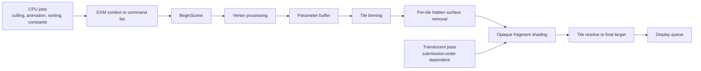

# PS Vita Rendering Techniques and Engine Optimisations for Maximum Throughput

## Executive summary

The PS Vita rewards engines that are built around its **PowerVR SGX543MP4+ tile-based deferred renderer** and its **scene-based GXM submission model**, not engines that merely treat it like a smaller immediate-mode console GPU. Sony’s public SCEE R&D deck shows that the GPU bins primitives into a **parameter buffer**, processes the screen in **tiles**, shades only **visible opaque fragments**, and pipelines **vertex work for one scene** against **fragment work for another**. In practice, that means the highest-value wins usually come from **reducing fragment cost**, **keeping scene/pass count low**, **batching opaque work by state/material**, **packing vertex data aggressively**, and **avoiding hard CPU–GPU synchronisation**. citeturn13view0turn18view0turn34view3

The architecture is unusually forgiving for some things and unusually unforgiving for others. Opaque overdraw is less dangerous than on an immediate-mode renderer because hidden opaque fragments are not shaded, and Sony’s public diagrams explicitly show why **MSAA can be relatively efficient** on this class of TBDR GPU. By contrast, **translucent and blended geometry** is processed in submission order and “each blended fragment gets shaded multiple times”, so particles, foliage, HUD compositing, and multi-pass post-processing can become the dominant bottleneck very quickly. citeturn13view0turn14view3

The public evidence base is uneven. Publicly linkable Sony material is thin, so the strongest accessible sources are: Sony’s **public SCEE “De Re PlayStation Vita” deck**, **VitaSDK-generated GXM docs and headers**, **ARM’s Cortex-A9 MPCore TRM**, **Imagination’s PowerVR guidance**, **Khronos’ PVRTC extension spec**, and public source code such as **vitaGL**, **libvita2d**, **nanovg-gxm**, and Vita-targeting game ports. That combination is enough to build a rigorous optimisation strategy, but it also means some recommendations below are clearly marked as **inferences** where the public web lacks a full Sony SDK cap table or hardware manual. citeturn13view0turn15view0turn18view0turn0search2turn0search1turn22search17turn46view0turn24search0

## Scope and unspecified constraints

A few constraints were not specified, and they materially change the best optimisation path:

- whether you are targeting **native GXM**, a wrapper such as **vitaGL**, or a partner engine such as **PhyreEngine**;
- whether your goal is **locked 30 fps**, **locked 60 fps**, or simply “as fast as possible” with variable frame rate;
- whether you intend to ship at **native 960×544**, **dynamic resolution**, or a permanent internal downscale;
- whether your content is mostly **opaque 3D**, **alpha-heavy stylised rendering**, **2D/UI**, or **post-process-heavy deferred effects**.

For licensed developers, Sony’s public deck notes that **PhyreEngine** was available as a PlayStation-optimised engine and provided as source to partners. For public/homebrew-accessible workflows, the available evidence is mostly VitaSDK/GXM-style APIs and wrappers such as vitaGL or libvita2d. The recommendations below assume a **custom or thin-wrapper 3D renderer** on retail-class memory budgets, where consistency and frame pacing matter more than chasing isolated benchmark spikes. citeturn13view0

## Hardware architecture

Public Sony/SCEE material and teardown evidence agree on the broad platform shape: a **quad-core ARM CPU**, a **PowerVR SGX543MP4+ GPU**, **main memory** plus a separate **video-memory pool**, and a **960×544** display. iFixit’s teardown summary lists a **quad-core ARM Cortex-A9 MPCore**, **quad-core SGX543MP4+**, **512 MB RAM**, and **128 MB VRAM**, while Sony’s public SCEE deck depicts the Vita as a quad-core ARM CPU plus SGX543MP4+ connected to **Main Memory** and **VRAM**. citeturn11search3turn13view0turn14view0

In the public API surface, that split becomes important. VitaSDK exposes **physically contiguous memory** and **accessible CDRAM** budgets in `SceAppMgrBudgetInfo`, and the GXM initialisation flags include `SCE_GXM_INITIALIZE_FLAG_PB_LPDDR`, described as allocating the **parameter buffer from main LPDDR instead of CDRAM**. In other words, public GXM documentation itself encodes the idea that memory placement matters for performance. A practical example appears in libvita2d, whose source comments that **CDRAM is inaccessible in system-app mode**, forcing fallback to a normal user memory type instead. citeturn10search5turn10search2turn10search8turn10search6

Public packaging analysis adds one more useful clue. Chipworks reported that the Vita uses a stacked package containing the processor die, a **wide-I/O SDRAM die**, and additional **LPDDR2 SDRAM** dies. That is consistent with Sony’s public “main memory plus video memory” model and helps explain why graphics-memory placement and render-target traffic are practical optimisation concerns on Vita. What the public English web does **not** provide cleanly is a complete official disclosure of every internal **bus width**, **arbiter policy**, or **cache topology**. citeturn11search8turn13view0turn10search5

For CPU-side behaviour, the most reliable public reference is the **ARM Cortex-A9 MPCore Technical Reference Manual**. That is not a Vita-only document, but it is the right baseline for optimisation work: assume normal Cortex-A9-style sensitivity to **cache locality**, **working-set size**, and **cross-core cache contention**. On Vita, that means worker jobs should be **small, contiguous, and ownership-clean** rather than pushing large pointer-chasing structures or heavily shared mutable state through all four cores. citeturn0search2

The GPU is the real architectural hinge. Sony’s public deck explicitly contrasts **immediate-mode rendering** with Vita’s **tile-based deferred renderer**: the screen is split into tiles, each tile references relevant primitives via the **parameter buffer**, **only visible opaque fragments are shaded**, and **translucent geometry** is processed in submission order, with each blended fragment potentially shaded multiple times. Sony also contrasts the MSAA path on immediate-mode versus tile-based rendering, showing why MSAA can be comparatively attractive on a tiler. For engine design, the direct implication is simple: **opaque-friendly, low-overdraw, low-pass-count renderers fit Vita best; alpha-heavy and resolve-heavy renderers do not**. citeturn13view0turn14view1turn14view3

## GXM and the Vita graphics pipeline

GXM is lower level than OpenGL-style APIs and exposes many of the knobs that matter to performance. Public VitaSDK documentation shows **immediate contexts** via `sceGxmCreateContext`, **deferred contexts** via `sceGxmCreateDeferredContext`, **command lists** via `sceGxmBeginCommandList` / `sceGxmEndCommandList` / `sceGxmExecuteCommandList`, **precomputed state and draw objects** via `sceGxmSetPrecomputedVertexState`, `sceGxmSetPrecomputedFragmentState`, and `sceGxmDrawPrecomputed`, **instanced draws** via `sceGxmDrawInstanced`, **visibility buffers** via `sceGxmSetVisibilityBuffer`, and explicit **scene boundaries** via `sceGxmBeginScene`, `sceGxmMidSceneFlush`, and `sceGxmEndScene`. It also exposes **region clipping**, **depth/stencil control**, **front/back visibility tests**, and **display-queue synchronisation**. citeturn18view0turn15view0

Sony’s public SCEE deck characterises Vita’s shader capability as **“Shader Model 3.x+”** in the broad sense of familiar **vertex/fragment shaders**, **textures**, **geometry**, and **render targets**. Public GXM headers reinforce that picture: vertex attributes support formats such as **U8/S8/U16/S16**, **normalized integer variants**, **F16**, and **F32**; fragment output register formats include **half** and **float** permutations; MSAA supports **none**, **2x**, and **4x**; and GXM textures can be initialised as **swizzled**, **linear**, **linear-strided**, **tiled**, or **cube** textures. citeturn13view0turn15view0turn16view1turn16view4turn19view0turn19view2

The most underappreciated public clue is Sony’s explanation of **scene pipelining**. The deck shows that within a scene the GPU does **vertex then fragment processing**, but across scenes it can overlap **vertex work for one scene** with **fragment work for another**. It also says the GPU consumes work in **“relatively large jobs”**. That makes scene fragmentation a genuine throughput problem: if you split a frame into too many tiny scenes, mid-scene flushes, or render-target swaps, you erode the pipelining that the hardware wants. citeturn13view0



That public pipeline model leads to a very specific scheduling pattern: do as much **CPU preparation** as possible before or in parallel with submission, keep the **opaque scene** large and coherent, and treat **scene boundaries** as expensive structural choices rather than cosmetic API markers. Sony’s own public diagrams, plus the GXM API surface for deferred contexts and command lists, point in exactly that direction. citeturn13view0turn18view0

If you have access to licensed Sony tooling, profiling should focus on **parameter-buffer usage**, **scene timing**, and **CPU/GPU pipeline overlap**. Even in public code, vitaGL exposes profiling hooks, user markers, Razor integration flags, and live GPU metrics for **parameter-buffer usage**. Public GXM docs also expose `sceGxmPushUserMarker`, `sceGxmPopUserMarker`, and `sceGxmSetUserMarker`, which are the right level of instrumentation for diagnosing whether your frame is submission-bound, tile-bound, or sync-bound. citeturn18view0turn26view0turn35view1

## Bottlenecks and what they imply

The most common Vita bottleneck is **fragment cost**, especially when the content fights the tiler. Sony’s public deck makes the key distinction: for opaque geometry, only visible fragments are shaded; for translucent geometry, fragments are processed in submission order and can be shaded multiple times. That is why particle-heavy effects, alpha-blended foliage, large translucent UI layers, and repeated full-screen passes tend to collapse performance earlier than well-batched opaque scenes of similar geometric complexity. citeturn13view0

The next bottleneck is **memory bandwidth**. Public GXM documentation exposes multiple texture layouts and many compact vertex formats precisely because bandwidth is precious, and VitaSDK’s **GXT manipulation library** is described as handling textures produced by **offline texture tools**. On the vendor side, Imagination’s PVRTC documentation and the Khronos PVRTC extension spec make the same point from another angle: **hardware-friendly compression** reduces memory footprint and texture traffic. If your asset pipeline leaves textures in generic RGBA8 form, uploads them in non-native layouts, or omits mips, you are volunteering for bandwidth problems. citeturn19view2turn22search1turn22search7turn22search14turn22search15turn22search17

A third bottleneck is **CPU–GPU synchronisation**. Public GXM docs define `sceGxmFinish()` as blocking until the GPU finishes rendering, and `sceGxmDisplayQueueFinish()` as waiting until all pending display swaps complete. vitaGL makes the danger concrete: its `glFinish()` literally resets the scene and calls `sceGxmFinish(gxm_context)`. Those calls are appropriate for teardown, readback-heavy debugging, or carefully chosen fences. They are disastrous as normal frame-loop behaviour. citeturn16view3turn18view0turn34view3

A fourth bottleneck is **draw-call and state overhead on the CPU side**. This is where many ports leave performance on the table. The public API offers instancing, command lists, deferred contexts, and precomputed draw/state objects for a reason; public Vita wrappers and ports also expose “draw speedhack” switches and changelog references to measurable frame-rate improvements after reducing draw overhead. That is strong practical evidence that submission cost, not just raw shader cost, matters on Vita. citeturn18view0turn26view0turn23search2

The fifth bottleneck is **vertex/index and attribute bandwidth**, often amplified by hidden conversions. In public vitaGL code, the `glDrawElements` path expands **8-bit indices into a temporary 16-bit buffer** because GXM does not accept native 8-bit index draws, then dispatches 16-bit or 32-bit draws directly. The same public code maps colours and texture coordinates to **S16N/U16N/S8N/U8N** when the source type allows it. That is a good model: avoid formats that trigger CPU translation, and shrink attributes until quality visibly breaks. citeturn30view0turn30view1turn39view0turn19view0

## Optimisation patterns with public code evidence

### Tiler-aware pass structure

On Vita, **opaque state sorting** is usually a better first move than obsessive front-to-back sorting. That is an inference from the tile-based deferred model: the architecture already avoids shading hidden opaque fragments, so the marginal gain from perfect front-to-back ordering is lower than on an immediate-mode renderer. By contrast, reducing **state changes**, **scene breaks**, and **extra passes** directly reduces CPU submission cost and preserves the GPU’s preferred large-job pipelining. citeturn13view0turn18view0

A **blanket depth pre-pass** is therefore not something I would recommend by default. On Vita it is usually **situational**: helpful when fragment shaders are unusually expensive, when later passes depend heavily on depth, or when a material system benefits from a classification pass; otherwise it often duplicates work that the TBDR’s opaque hidden-surface removal already handles well. That conclusion is an inference from Sony’s public tile-based rendering explanation rather than an explicit Sony rule. citeturn13view0turn14view1

**Region clip / scissor** is more important on Vita than many engines assume, because on a tiler it can act as a real **tile-level workload reduction**. Public vitaGL code maps an enabled scissor rectangle to `sceGxmSetRegionClip(..., SCE_GXM_REGION_CLIP_OUTSIDE, ...)`, and the library’s README states that disabling its “tile clipper” slightly reduces CPU work but **increases GPU work**. That is exactly the right mental model: use aggressive clip regions for UI panes, mirrors, portals, scoped post effects, mini-maps, letterboxing, and any pass that only touches a bounded screen region. citeturn34view2turn26view0

```c
// Adapted from vitaGL/source/gxm.c, lines 3400-3402
if (scissorEnabled) {
    sceGxmSetRegionClip(
        gxm_context,
        SCE_GXM_REGION_CLIP_OUTSIDE,
        x0, y0, x1, y1
    );
}
```

The logic above is small, but it is archetypal Vita code: tell the tiler exactly which tiles matter, and do it as early as possible. citeturn34view2

### Geometry, batching, instancing, and packed attributes

**Batching** and **state sorting** remain high-return optimisations, but on Vita they should be framed as both **CPU submission** and **parameter-buffer** optimisations. Batch opaque work by render target, shader, texture set, blend state, and depth state; keep material buckets large; and only then consider secondary sort orders such as depth within bucket. The GXM API surface for command lists, deferred contexts, precomputed draw/state, and instancing exists to support exactly this kind of pipeline. citeturn18view0turn15view0

Instancing is not theoretical on Vita; it is a first-class draw path. In public vitaGL code, `glDrawElementsInstanced()` resolves the index source and sends the work through `sceGxmDrawInstanced()` for both 16-bit and 32-bit indices. If your scene contains repeated props, grass clumps, shell casings, light volumes, crowd impostors, or repeated particles with the same mesh, this is one of the cleanest ways to crush draw overhead. citeturn30view1

```c
// Adapted from vitaGL/source/draw.c, lines 2688-2702
if (indexType == U32) {
    setup_elements_indices_u32();
    sceGxmDrawInstanced(ctx, prim, SCE_GXM_INDEX_FORMAT_U32, idx, count * instanceCount, count);
} else {
    setup_elements_indices_u16();
    sceGxmDrawInstanced(ctx, prim, SCE_GXM_INDEX_FORMAT_U16, idx, count * instanceCount, count);
}
```

The same source file shows another practical lesson: **do not rely on 8-bit indices** if your renderer targets GXM directly. vitaGL expands them to 16-bit in `source/draw.c` lines 2307–2320 before drawing, which means an otherwise “small” index buffer can become a hidden CPU-side unpack step on every draw. Standardise on **16-bit indices** wherever the mesh fits, and use **32-bit** only for genuinely large meshes. citeturn30view0

The best “fixed-point” optimisation on Vita is usually **fixed-point data**, not whole-engine fixed-point maths. Public GXM attribute formats include **normalized integer** and **half-float** variants, and public vitaGL code maps colour arrays to **S16N/U16N/S8N/U8N** instead of F32 when possible. That is the right default for colour, UVs, tangent frames, weights, and many secondary attributes: keep transforms and skinning in float unless profiling proves otherwise, but **pack the data path** aggressively. citeturn15view0turn19view0turn39view0

```c
// Adapted from vitaGL/source/buffers.c, lines 3293-3330
switch (type) {
    case GL_SHORT:         attr.format = SCE_GXM_ATTRIBUTE_FORMAT_S16N; break;
    case GL_UNSIGNED_SHORT:attr.format = SCE_GXM_ATTRIBUTE_FORMAT_U16N; break;
    case GL_BYTE:          attr.format = SCE_GXM_ATTRIBUTE_FORMAT_S8N;  break;
    case GL_UNSIGNED_BYTE: attr.format = SCE_GXM_ATTRIBUTE_FORMAT_U8N;  break;
    default:               attr.format = SCE_GXM_ATTRIBUTE_FORMAT_F32;  break;
}
```

That pattern is one of the most reliable Vita wins because it cuts **vertex-fetch bandwidth**, **cache pressure**, and often **memory footprint** simultaneously. citeturn39view0turn19view0

### Visibility and occlusion culling

CPU-side culling is still essential on Vita even though opaque hidden fragments are cheap, because **vertex processing** and **parameter-buffer growth** still cost real work. Frustum culling, portal/room culling, conservative distance culling, and rough occluder maps reduce the number of primitives that ever reach the parameter buffer. Sony’s public tile diagrams show why that matters: the parameter buffer is a central data structure in the whole tiled pipeline. citeturn13view0

Public source also shows that **hardware visibility testing** is available and usable. In `vitaGL/source/buffers.c`, the wrapper allocates a visibility buffer, binds it with `sceGxmSetVisibilityBuffer`, enables visibility testing around a query, and uses a notification fence when the result is requested. That is a good fit for **large, expensive, and uncertain** occludees, not for every small prop. Overusing queries can itself create sync pressure. citeturn38view1turn38view2turn38view5

```c
// Adapted from vitaGL/source/buffers.c, lines 2207-2209, 2298-2338, 2365-2372
sceGxmSetVisibilityBuffer(ctx, queriesBuffer, stridePerCore);
sceGxmSetFrontVisibilityTestEnable(ctx, SCE_GXM_VISIBILITY_TEST_ENABLED);
sceGxmSetBackVisibilityTestEnable(ctx, SCE_GXM_VISIBILITY_TEST_ENABLED);
// draw occlusion-tested object here
sceGxmSetFrontVisibilityTestEnable(ctx, SCE_GXM_VISIBILITY_TEST_DISABLED);
sceGxmSetBackVisibilityTestEnable(ctx, SCE_GXM_VISIBILITY_TEST_DISABLED);
// later: wait only if you truly need the result now
sceGxmNotificationWait(&queryFence);
```

The design lesson is important: use queries as a **coarse, selective filter**, not as a universal visibility system. citeturn38view2

### Textures, render targets, and memory placement

Your texture pipeline should be **offline-first**. Public GXM docs expose initialisers for **swizzled**, **linear**, **linear-strided**, **tiled**, and **cube** textures, and VitaSDK exposes a **GXT** library specifically for runtime manipulation of textures produced by **offline texture tools**. That is a strong signal that runtime texture conversion is the wrong priority on Vita; prepare native-friendly data offline and upload it in the format the GPU wants. citeturn19view2turn22search1turn22search7

For native hardware compression on PowerVR, **PVRTC/PVRTC2** is the safest public recommendation. Imagination’s PVRTexTool and PVRTC documentation, plus Khronos’ PVRTC extension spec, all point to PVRTC as the platform-native family for this GPU generation. Use it for large, relatively smooth or stylised textures where the quality trade-off is acceptable; fall back to heavier formats only when artefacts are unacceptable. citeturn22search14turn22search15turn22search17

Public wrappers expose memory placement because it matters in practice. **nanovg-gxm** allows textures to be placed in either **system memory (LPDDR)** or **video memory / CDRAM**, and even lets you choose the default. libvita2d’s source comments that system-app mode cannot use CDRAM. The practical rule is to place **hot render targets** and **frequently sampled large textures** in the graphics-friendly pool when budget allows, and keep colder or CPU-owned assets in the main pool. citeturn23search1turn10search6turn10search5

Public open-source renderers also show how much care Vita needs around texture updates and render-target lifetimes. In `vitaGL/source/textures.c` lines 4043–4088, recently used textures are copied to a **fresh GPU memory location** before update and the descriptor is repointed, which is a practical hazard-avoidance/cacheability pattern. In `vitaGL/source/gxm.c`, the library also exposes toggles for **shared render targets** and, when it runs out of render-target handles, it can **recycle an older render target** after a `sceGxmFinish()`. Both are concrete reminders that **render-target churn** and **resource lifetime** are first-order concerns on Vita. citeturn39view1turn26view0turn34view3

A real game-port example makes the content-side answer obvious: the public OpenMW Vita port reports **640×368 internal rendering upscaled to 960×544** and a **dynamic fog system** that auto-scales draw distance to hold target frame rate. GTA:SA Vita’s public changelog also attributes performance wins to updates in vitaGL and a draw-related speedhack. Before you reach for risky low-level hacks, first ask whether a **resolution cut**, **distance cut**, or **alpha/post-process cut** will buy the same performance more safely. citeturn23search9turn23search2

### CPU parallelism, job systems, and DMA

The public API is compatible with a real **job-system** approach. GXM exposes **deferred contexts** and **command lists**; the public docs also expose **display queue thread affinity** flags for CPU 1 or CPU 2; VitaSDK exposes a **fibre API**; and public wrappers such as vitaGL expose toggles for background GC threads, `pthread` support, and single-threaded fallbacks. The strong practical pattern is therefore: keep a **single render-owner thread** for final submission, but farm out **visibility**, **animation**, **decompression**, **skinning preparation**, **material sorting**, and **command recording/setup** to worker threads or fibres. citeturn18view0turn15view0turn17search17turn26view0

For transient geometry and dynamic resources, favour **ring/circular-pool allocation** over per-draw heap churn. Public vitaGL configuration flags explicitly mention a **single-buffer circular pool**, **scratch memory for GL_DYNAMIC / GL_STREAM VBOs**, and physically contiguous RAM handled on demand. That is exactly the sort of structure that aligns with the Vita’s submission style: transient buffers should come from **preallocated, contiguous, recyclable pools**. citeturn26view0

DMA is worth benchmarking, not blindly trusting. Public vitaGL guidance includes a `NO_DMAC=1` option described as disabling `sceDmacMemcpy`, and notes that in some rare cases doing so can **improve frame rate**. The right conclusion is not “never use DMA”; it is “**use DMA for large, linear copies only if your own profile proves it wins on your workload**.” On Vita, CPU memcpy, DMA setup overhead, and contention patterns can make the answer more workload-specific than people expect. citeturn26view0

Finally, buffering strategy matters. Public GXM docs describe the display queue and sync objects; public vitaGL code sets `displayQueueMaxPendingCount` from the chosen display-buffer count and exposes a `vglUseTripleBuffering()` toggle. If your frame is suffering from back-pressure and occasional GPU spikes, **triple buffering** can reduce visible stalls at a memory cost; if latency or memory is tighter, stay on **double buffering** and attack the real bottleneck instead. citeturn18view0turn35view0turn34view3

### Inspected public code paths

| Public code path | What it illustrates | Source |
|---|---|---|
| `vitaGL/source/gxm.c` lines 3400–3402 | Scissor mapped to `sceGxmSetRegionClip`, i.e. tiler-aware clipping rather than a purely late raster clip | citeturn34view2 |
| `vitaGL/source/buffers.c` lines 2207–2209 | Allocation and binding of a GXM visibility buffer | citeturn38view1 |
| `vitaGL/source/buffers.c` lines 2298–2338 and 2365–2372 | Hardware visibility query enable/disable plus fence wait on result request | citeturn38view0turn38view2 |
| `vitaGL/source/draw.c` lines 2307–2320 | 8-bit indices expanded to 16-bit because GXM draw calls do not take native 8-bit indices | citeturn30view0 |
| `vitaGL/source/draw.c` lines 2688–2702 | Direct instanced dispatch through `sceGxmDrawInstanced` | citeturn30view1 |
| `vitaGL/source/buffers.c` lines 3293–3330 | Attribute packing to `S16N/U16N/S8N/U8N` instead of always F32 | citeturn39view0 |
| `vitaGL/source/textures.c` lines 4043–4088 | Repointing a recently used texture to fresh GPU memory before update | citeturn39view1 |
| `vitaGL/source/gxm.c` lines 2869–2884 and 2912–2920 | Tuning parameter-buffer and ring-buffer sizes, plus explicit PB placement flags | citeturn35view0turn35view1turn35view3 |

## Prioritised checklist, comparison matrix, and public source bundle

### Ranked checklist

| Priority | Action | Expected impact | Difficulty | Why it belongs near the top |
|---|---|---:|---:|---|
| Highest | Cut **pixel cost** first: lower internal resolution, trim alpha/blended effects, reduce full-screen passes, and bound work with scissor/region clip | Very high | Low to medium | Vita’s TBDR is forgiving for opaque visibility, but translucent and full-screen work remains expensive; public ports also show dynamic resolution and visibility trimming as practical wins | citeturn13view0turn34view2turn23search9 |
| Highest | Keep the **opaque scene** large and coherent: batch by material/state, minimise scene breaks and target swaps, avoid `sceGxmFinish` in the frame loop | Very high | Medium | Sony’s public slides emphasise scene pipelining and large jobs; `sceGxmFinish` is an explicit stall | citeturn13view0turn18view0turn34view3 |
| High | Standardise on **16-bit indices** and aggressively **pack attributes** into U8N/S8N/U16N/F16 | High | Medium | Public code shows 8-bit indices cause conversion overhead and compact attribute formats are directly supported | citeturn30view0turn39view0turn19view0 |
| High | Prepare textures **offline** in native-friendly layouts and compression; use mips everywhere practical | High | Medium | Public GXM/GXT docs and PowerVR docs all point towards offline-prepared, compression-friendly assets | citeturn19view2turn22search1turn22search7turn22search14turn22search17 |
| High | Use **instancing**, **command lists**, **deferred contexts**, and **precomputed state/draw** for repeated work | High | Medium to high | These are directly exposed in GXM because CPU submission cost matters | citeturn18view0turn30view1 |
| Medium | Use **hardware occlusion / visibility tests** only for large, expensive uncertain draws | Medium to high | Medium | Public code proves the path exists, but query fences can become a source of stalls if overused | citeturn38view1turn38view2 |
| Medium | Pick **CDRAM vs LPDDR** deliberately for hot targets/textures, and share/recycle render targets where possible | Medium | Medium | Public wrappers expose placement and render-target sharing because it changes real performance and memory behaviour | citeturn23search1turn10search5turn26view0turn34view3 |
| Medium | Build a **worker-job system** for culling, animation, decompression, sorting, and command prep; benchmark DMA instead of assuming it wins | Medium | High | GXM and VitaSDK provide the right primitives, but the engineering cost is real; DMA is workload-dependent | citeturn18view0turn15view0turn17search17turn26view0 |

### Technique comparison

| Technique | Why it works on Vita | Trade-offs | Apply when | Source |
|---|---|---|---|---|
| Opaque forward rendering with strong state sorting | Aligns with TBDR opaque visibility and avoids storing/re-reading a large G-buffer | Less flexible for many dynamic lights | Baseline choice for most Vita 3D renderers | citeturn13view0 |
| Compact/light pre-pass or tightly packed deferred approach | Can handle more lights, but keeps G-buffer discipline tighter than a PC-style full deferred layout | More passes, more target complexity, transparency gets awkward | Many small dynamic lights and modest material complexity | citeturn13view0turn19view1 |
| Full fat multi-target deferred renderer | Possible in principle, but can give away tile-memory advantages by forcing extra render-target traffic | High bandwidth, high memory pressure, awkward transparency | Rarely the first choice; use only if lighting needs dominate and you can keep buffers tiny | citeturn13view0turn18view0 |
| Selective depth pre-pass | Can pay off when later fragment shaders are unusually expensive | Extra pass; lower generic upside on a TBDR than on an IMR | Expensive materials, depth-dependent later passes | citeturn13view0 |
| Region clip / tiler-aware scissor | Reduces work at the tile level | Slight CPU bookkeeping | UI panes, split-screen, mirrors, mini-maps, local post | citeturn34view2turn26view0 |
| Hardware visibility queries | Removes expensive hidden draws before later frames | Query management and fences can stall if abused | Large uncertain occludees, not micro-props | citeturn38view1turn38view2 |
| Instancing | Slashes draw-call overhead for repeated meshes | Requires instance-friendly data and render scheduling | Props, repeated particles, crowd impostors, foliage clumps | citeturn18view0turn30view1 |
| Packed attributes / fixed-point data | Cuts vertex bandwidth and memory footprint | Precision/quality validation required | Colours, UVs, tangents, weights, many secondary attributes | citeturn19view0turn39view0 |
| PVRTC / native-friendly texture compression | Lowers memory and bandwidth on PowerVR hardware | Quality can suffer on some art styles | Large static textures, stylised/albedo-heavy content | citeturn22search14turn22search15turn22search17 |
| Dynamic resolution / distance and fog scaling | Directly attacks the most common bottleneck: fragment cost | Visual softness and more tuning complexity | Open-world or traversal-heavy scenes with unstable load | citeturn23search9 |
| Triple buffering | Reduces visible back-pressure from GPU spikes | More memory, potentially more latency | Frames are sync-limited more than purely throughput-limited | citeturn18view0turn34view3turn35view0 |
| DMA-assisted streaming copies | May reduce CPU cost for some large linear transfers | Setup overhead; can lose on some workloads | Very large uploads or streaming copies, after profiling | citeturn26view0 |

### Public source bundle

| Category | Recommended public materials |
|---|---|
| Public Sony / vendor / standards material | Sony SCEE’s public **De Re PlayStation Vita** deck is the single most useful public architectural overview; pair it with ARM’s **Cortex-A9 MPCore TRM**, Imagination’s **PowerVR Performance Recommendations** and **Series5 SGX architecture guide**, plus Khronos’ **`IMG_texture_compression_pvrtc`** specification and Imagination’s PVRTC/PVRTexTool docs | citeturn13view0turn0search2turn0search1turn3search10turn22search14turn22search17 |
| Public API references | VitaSDK’s generated docs for **`SceGxmUser`**, **`gxm.h`**, **`SceAppMgrBudgetInfo`**, and **`fiber.h`** are the best public references for the GXM API surface, memory-budget fields, and cooperative threading primitives | citeturn15view0turn18view0turn10search5turn17search17 |
| Public source repos, samples, and demos | **VitaSDK** and its **`samples`** repo; **vita-headers**; **vitaGL**; **libvita2d**; **nanovg-gxm**; public ports such as **OpenMW Vita** and **GTA:SA Vita** | citeturn46view0turn24search0turn10search6turn23search1turn23search9turn23search2 |
| Talks, interviews, forums, and postmortems | Sony’s official **PlayStation Blog** interview on **Killzone: Mercenary**; GameDeveloper’s **Uncharted: Golden Abyss** postmortem; GameDeveloper’s **Indoor Pub Games Sports World PS Vita** postmortem; the community thread **“Having fun with libgxm”** as a useful onboarding/forum source rather than a source of truth | citeturn44search0turn44search5turn44search1turn17search10 |

### Bottom-line recommendation

If the goal is simply **“render as fast as possible on Vita”**, the order of attack should be: **cut fragment work**, **keep opaque scenes large and coherent**, **avoid serialising the CPU and GPU**, **pack all geometry/attributes**, **prepare textures offline in native-friendly formats**, and only then pursue more difficult gains such as **hardware occlusion**, **deferred-command recording**, **DMA tuning**, or **custom low-level hacks**. That prioritisation is the most consistent conclusion across Sony’s public tile-based rendering explanation, the public GXM API surface, and the behaviour visible in open-source Vita renderers and ports. citeturn13view0turn18view0turn26view0turn23search9